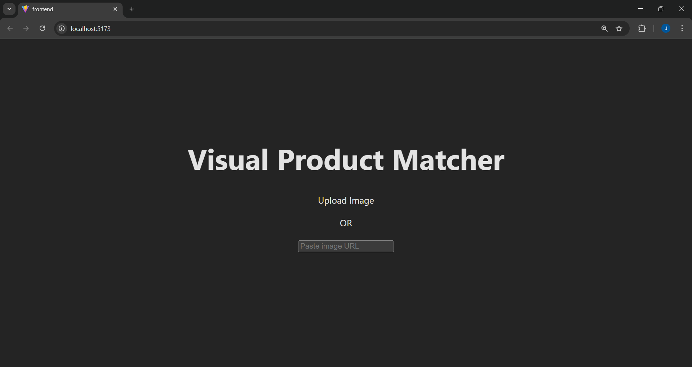
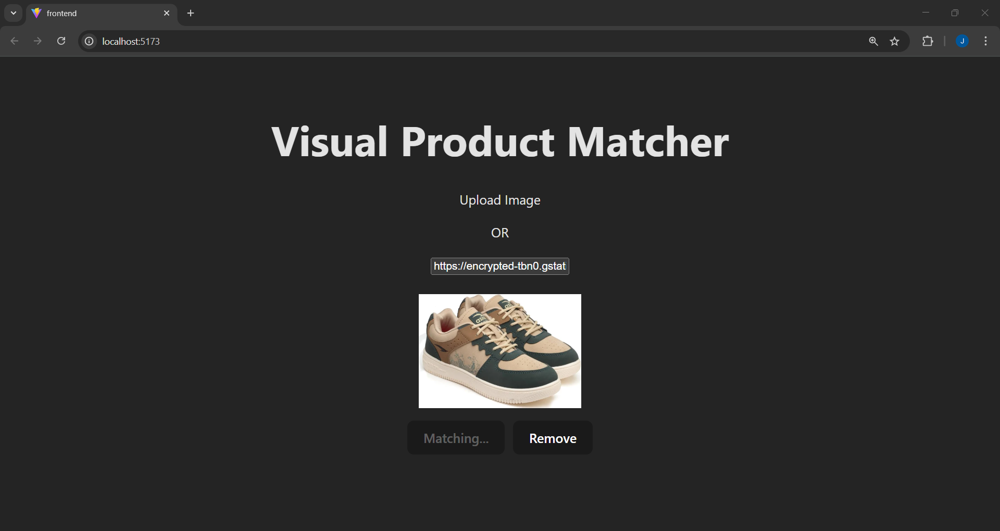

# Visual Product Matcher

A web application that uses AI to find visually similar products from a database using OpenAI's CLIP model. Upload an image or provide an image URL, and the system will return visually similar products ranked by similarity score.

# Deployment Note

Due to resource limitations on free-tier hosting platforms, the Python microservice for this project (which uses the CLIP model for image similarity) could not be deployed alongside the Node.js backend. The microservice requires GPU support and significant storage for model weights, which exceeds the limits of most free hosting solutions.

Hosting URL (Python Microservice not deployed): https://visual-product-matcher-tawny.vercel.app/







## Technologies Used

### Frontend

- React.js
- Axios for HTTP requests
- CSS Grid for responsive layout

### Backend

- Node.js & Express.js
- MongoDB for product database
- Multer for file uploads
- Python FastAPI service for image matching

### AI/ML

- OpenAI CLIP model for visual similarity
- PyTorch for deep learning operations
- Pillow for image processing

## Features

- Image upload via file or URL
- Real-time image preview
- Visual similarity matching using CLIP embeddings
- Sorted results by similarity score
- Responsive grid layout for results
- Error handling and loading states

## Project Structure

```
Visual-Product-Matcher/
├── frontend/                # React frontend
│   ├── src/
│   │   ├── components/     # React components
│   │   └── App.jsx        # Main application component
│   └── package.json
│
├── backend/                 # Node.js backend
│   ├── config/             # Database configuration
│   ├── controller/         # Request handlers
│   ├── routes/            # API routes
│   ├── python/            # Python AI service
│   │   └── image_matcher.py
│   └── server.js          # Express server
```

## Setup Instructions

### Prerequisites

- Node.js
- Python 3.8+
- MongoDB
- Git

### Installation

1. Clone the repository:

```bash
git clone [repository-url]
cd Visual-Product-Matcher
```

2. Install frontend dependencies:

```bash
cd frontend
npm install
```

3. Install backend dependencies:

```bash
cd ../backend
npm install
```

4. Install Python dependencies:

```bash
cd python
pip install -r requirements.txt
```

5. Configure MongoDB:

- Create a `.env` file in the backend directory
- Add your MongoDB connection string:

```
MONGODB_URI=your_mongodb_connection_string
DB_NAME=your_database_name
COLLECTION_NAME=your_collection_name
```

### Running the Application

1. Start the Python AI service:

```bash
cd backend/python
uvicorn image_matcher:app --host 0.0.0.0 --port 8000
```

2. Start the Node.js backend:

```bash
cd backend
npm start
```

3. Start the React frontend:

```bash
cd frontend
npm run dev
```

The application will be available at `http://localhost:5173`

## API Endpoints

### `POST /api/matches`

Upload an image or provide an image URL to find similar products.

**Request:**

- Method: POST
- Content-Type: multipart/form-data
- Body:
  - `image`: File upload
  - `imageUrl`: URL string (alternative to file upload)

**Response:**

```json
[
  {
    "image_url": "string",
    "name": "string",
    "category": "string",
    "similarity": float
  }
]
```
